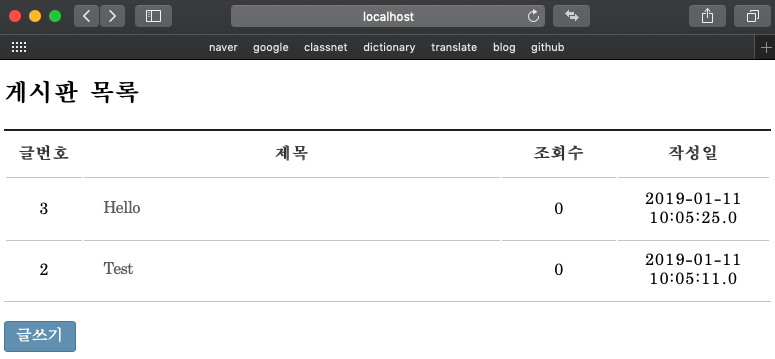

# 스프링 프레임워크를 활용한 게시판 관리
스프링 프레임워크와 MVC 패턴 구조를 활용한 웹 게시판 관리

## 1. 환경설정
* Language : JAVA SE 9.0.1, JSP 2.3
* Database : Oracle-12c 
* Web Server : Tomcat 9.0.12
* Spring 3.2.4
* MyBatis 3.2.2
* Maven 3.3.9

## 2. 참고사항
1. Docker 에서 Oracle 사용
```
$ docker run --name oracle12c -d -p 59160:22 -p 59161:1521 -v sath89/oracle-12c
$ docker exec -it oracle12c sqlplus

$ lsof -PiTCP -sTCP:LISTEN
```
2. board.sql 실행하기 (게시판 구축 쿼리)

3. 톰캣실행

## 3. 게시판 화면
* http://localhost:8080/first/sample/openBoardList.do
